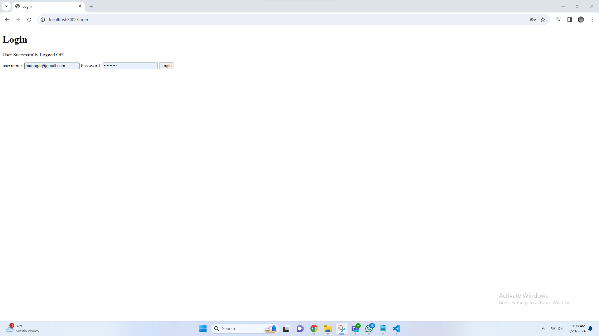
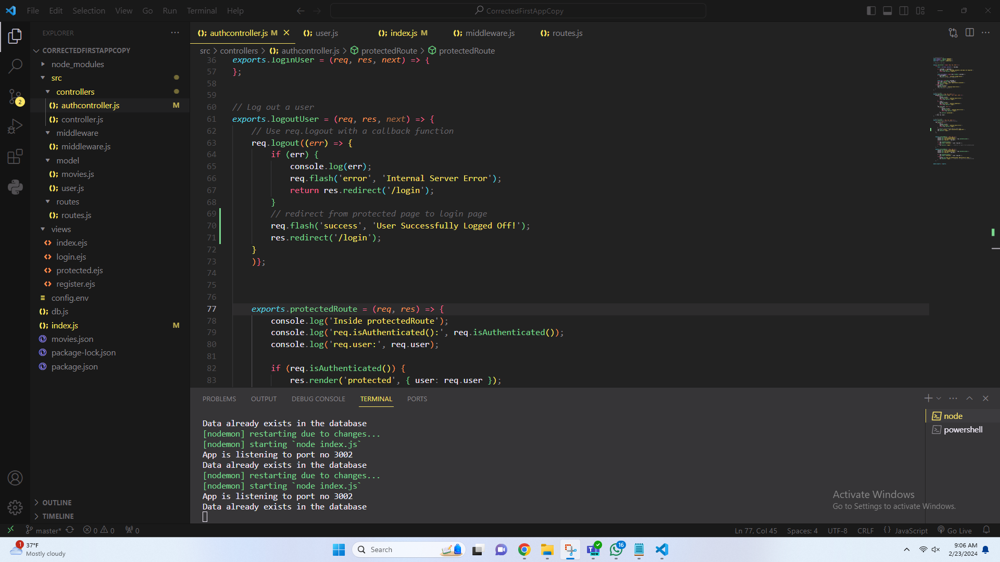
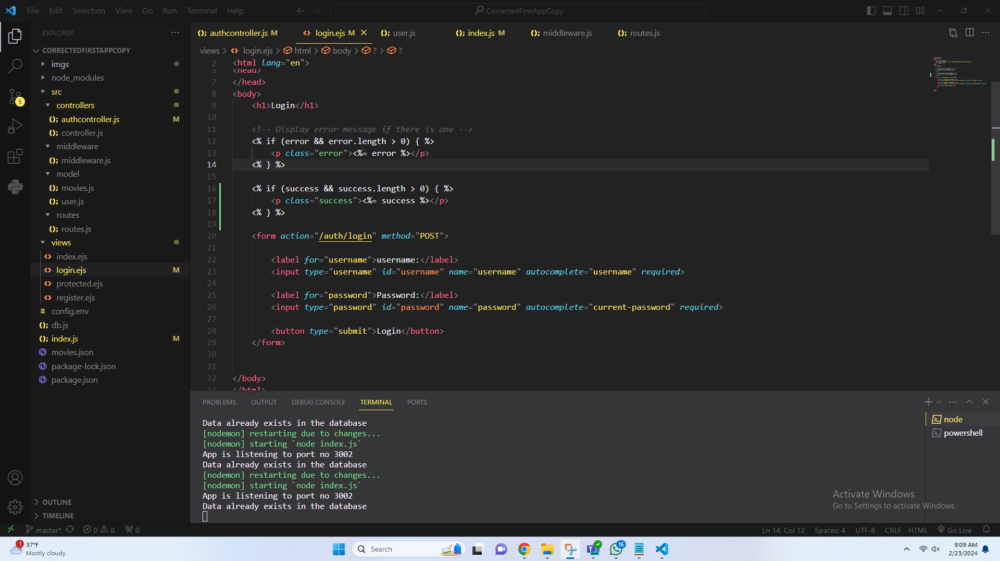

# Lab 7 - Module: 24W Mobile APIs and Frameworks - 01

## Overview
This repository contains the implementation of Lab 7 for the Module 24W Mobile APIs and Frameworks - 01. The project focuses on developing features related to mobile APIs and frameworks.

## Author
- Name: Andara Pintuge Menuka Shewon Aquinas Pinto

## Project Screenshots

### Login Redirection

This feature demonstrates the login redirection functionality.

### Code Changes

#### Login Re-direct

The code change is from line 70 to 71.

#### Logout Message Display

The code change is from line 16 to 19.

